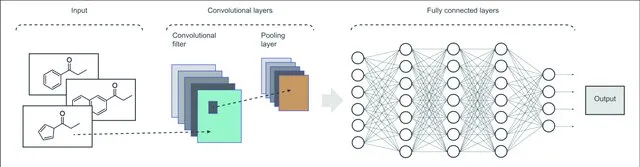

## Definition

-   Drug discovery is a complex and time-consuming process that involves identifying new drug candidates, testing their efficacy and toxicity, and optimizing their properties.

## Why AI?

-   Artificial intelligence (AI) has the potential to revolutionize drug discovery by accelerating the process and reducing the cost.

-   Using Machine Learning Algorithms, Researchers can identify new drug candidates and predict their efficacy and toxicity with high accuracy.

> Convolutional neural networks (CNNs) : Used to extract information from various datasets of different dimensions, including chemical and biological data. ( Part of Drug Discovery Process )

## Data Sets

[List of available data sets](./example-data.md)

## Code Snippet

The following sample code has been referenced from [Abdulkader Helwan's Medium Blog](https://abdulkaderhelwan.medium.com/accelerating-drug-discovery-with-cnn-e83d90d7e2f5)

-   [CODE](./code-examples/cnn-rdkit-keras.md)
